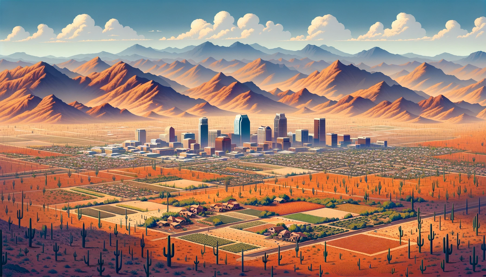
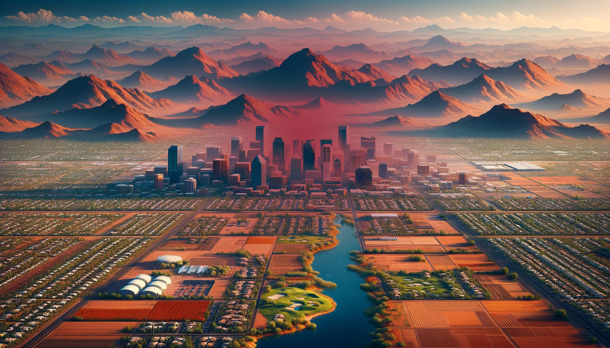
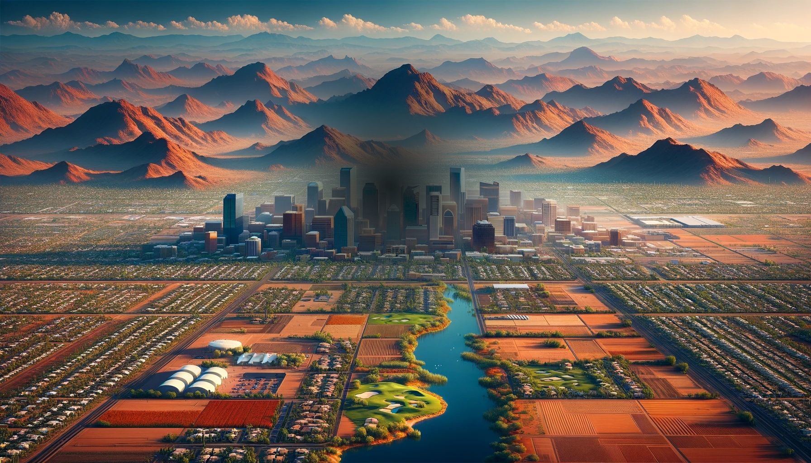
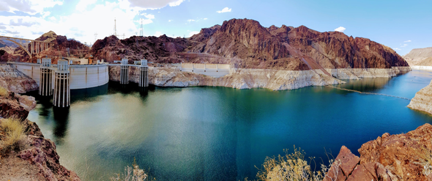
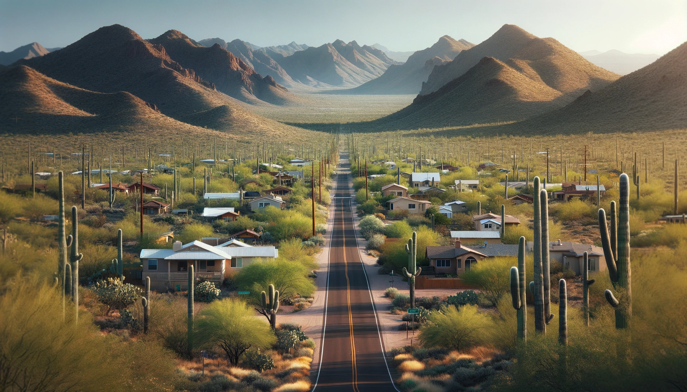
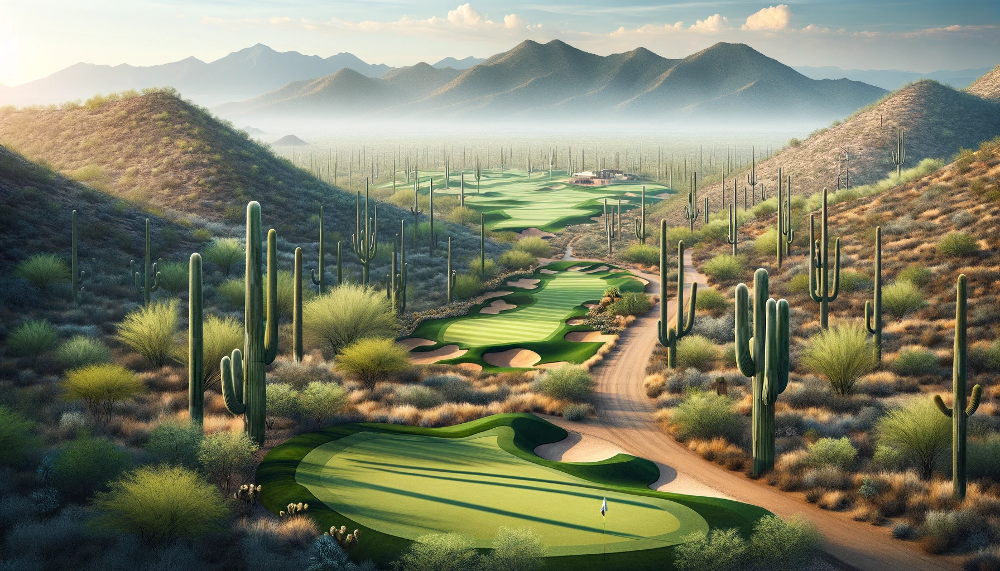
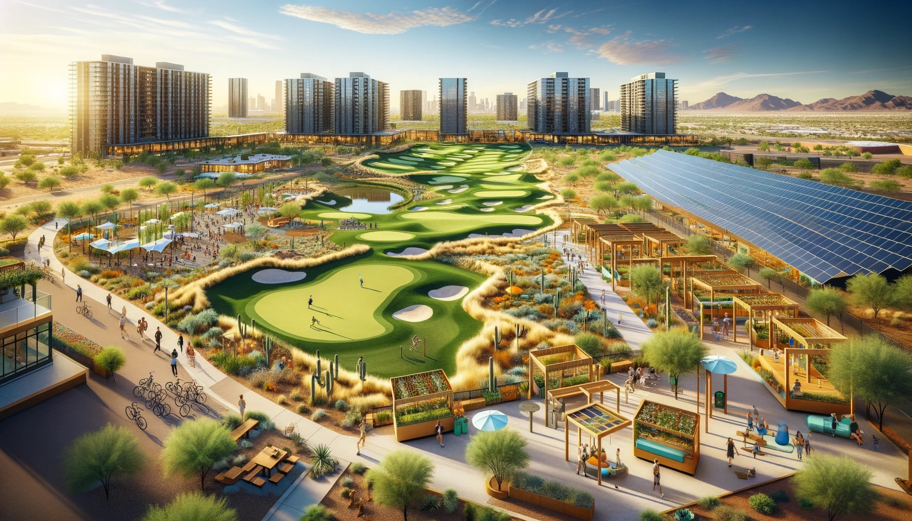

<br>
<br>

```{r setup, include=FALSE}
library(knitr)
knit_hooks$set(output_file = function(x) {
  "index.html"
})
```

Our research lab studies landscape sustainability, which focuses on studying and improving the relationships between landscape pattern and human well-being. To understand how we think about sustainability, you need to understand the landscape perspective.

### The landscape perspective
```{r, echo = FALSE, fig.height = 8, fig.width = 12, fig.align = "center"}

```

We can demonstrate the landscape perspective by examining a fictional landscape that resembles the Phoenix Metropolitan Area. This landscape is made up of many different features. In the background, you can see hills and mountains. At the foot of the mountains you see desert plants such as shrubs and cactus that serve as habitat for wildlife native to the Sonoran Desert. At the edge of the city, you begin to see elements that were built by humans like roads, houses, and agricultural fields. Moving in towards the center of the city you begin to see larger and taller buildings and more impervious surfaces. Each of these elements are like individual pieces of a patchwork quilt that have their own color and texture, but when viewed together they form a complete picture. All of the human and environmental elements in a landscape interact to form what we call a human-environmental system.

The landscape perspective holds that the relative abundance of each landscape element (i.e., the amount of roads/houses/agricultural area/desert within the landscape) affects the sustainability of the region. Also, the spatial pattern of the landscape elements (i.e., their position relative to each other) impacts the sustainability of the region. <span style="color: red;"> [Examples?] </span>

Our research lab is interested in understanding and improving the abundance and pattern of landscape elements (like golf courses), with the end goal of making Phoenix a more livable place for ourselves and future generations.


### Why Golf Courses?

```{r, echo = FALSE, fig.height = 8, fig.width = 12, fig.align = "center"}
knitr::include_graphics("preliminary_images/grayhawk_1.png")
```

<span style="color: red;"> [PHOTO: make this into a collage with at least 4 different desert golf courses pictured] </span>
 

In Phoenix, golf courses are a major feature of the landscape. In our research, we counted 210 unique 9- or 18-hole golf courses in Maricopa County that together cover an area larger than the city of Glendale, AZ! Because golf courses are such a prominent feature, they provide an important opportunity for improving regional sustainability in Phoenix. Today, the Phoenix metropolitan area faces multiple sustainability challenges, which can be addressed through golf course architecture and design.

<br>
<br>

### Sustainability Challenges in the Phoenix Metro Area:

<br>

#### 1. Urban Heat Island Effect
```{r, echo = FALSE, fig.height = 8, fig.width = 12, fig.align = "center"}

```

Over the past 50 years, Phoenix has been one of the fastest growing cities in the United states, and is often cited as an example of 'urban sprawl'. Over the last 50 years, we have replaced large expanses of desert with urban impervious surfaces such as asphalt and concrete. The recent urban expansion has led to the urban heat island effect--where the city center is much hotter than the surrounding desert--particularly at night. The UHI effect happens because the impervious surfaces absorb heat during the day and emit the heat throughout the night. In Phoenix, the UHI effect is especially dangerous because we already experience extreme heat in the summer. From 2020 to 2022, there were over 1,000 heat-related deaths in Maricopa County according to the Maricopa Department of Public Health. Extreme heat and the urban heat island effect will only be exacerbated by climate change, which is a major driver of regional environmental change.

<br>
<br>

#### 2. Air pollution
```{r, echo = FALSE, fig.height = 8, fig.width = 12, fig.align = "center"}

```

According to the American Lung Association State of the Air Report Card, the Phoenix Metro Area ranks in the top 15 out of all United States cities for ozone, short-term particle pollution, and long term particle pollution. These high rates of air pollution have a wide range of negative health effects for everyone living the area.

<br>
<br>

#### 3. Water Shortages

```{r, echo=FALSE, results='asis'}
cat('')
```

The Phoenix Metro Area is located in a hyper-arid desert, which presents some water sustainability challenges. One of largest water sources for the Phoenix Area is Colorado River water, which is transported from Lake Havasu to Phoenix through the CAP canal. Water storage on the Colorado River system has reached historically low levels in recent years due to over-allocation and climate change, leading to water delivery reductions to the state of Arizona. Another important water source is groundwater, which is being depleted faster than it is being replenished in the Phoenix AMA.

<br>
<br>

#### 4. Distributive Environmental Injustice

<span style="color: red;"> [COLLAGE OF PHOTOS:urban green spaces in Phoenix when the sun is out] </span>

Access to environmental services is not uniform across the Phoenix Metro Area. Studies have found that low-income neighborhoods in Phoenix are generally hotter during the summer because they lack access to urban vegetation and urban green spaces.

<br>
<br>

#### 5. Habitat Loss and Fragmentation

```{r, echo = FALSE, fig.height = 8, fig.width = 12, fig.align = "center"}

```

In general, the urban and agricultural expansion over the past 100 years has replaced natural Sonoran Desert habitat, which is home to many diverse plant and animal species endemic to the region. From a strong sustainability perspective, development is not inherently bad for sustainability. In the case of the Phoenix Metropolitan Area, it is important to ensure that habitat corridors exist to allow the movement of animals across urban infrastructure like roads and other impervious surfaces.  

<br>
<br>

### How do desert golf courses impact regional sustainability?

#### Ecosystem services

Although golf courses are highly modified landscapes, they are still ecosystems with the potential to provide ecosystem services. Ecosystem services are the benefits that humans receive from nature and they are closely tied to human well-being. <span style="color: red;"> [Create a diagram to show landscape pattern (city design) --> ecosystem services (provisioning, regulating, cultural) --> human well-being] </span>

1. **Provisioning services** provide the raw materials essential for life such as food, water, and timber. 
2. **Regulating services** can moderate or control ecosystem process, including regulating local climate, air pollution, erosion, pollination, and disease. 
3. **Cultural services** are non-material benefits we receive from nature and can include recreation, tourism, spiritual benefits, and social benefits.

#### Ecosystem Services Provided by Golf Courses 
<span style="color: red;"> [Create Icon for each ES] </span>

1. **Climate regulating services.** Golf courses provide climate regulating services to golfers and people living in their immediate vicinity because irrigated turf changes the surface energy balance compared to impervious surfaces or natural desert. <span style="color: red;"> [COLLAGE OF PHOTOS: Phoenix golf courses near urban structures when it is sunny outside! (Arizona Grand Golf Course)] </span>
2. **Air pollution regulating services.** Golf courses also provide air pollution regulating services to people living in the immediate vicinity--especially golf courses with tall trees. <span style="color: red;"> [COLLAGE OF PHOTOS: Phoenix golf courses with large trees (Biltmore?)] </span>
3. **Aesthetic services?** <span style="color: red;"> [COLLAGE OF PHOTOS: Beautiful courses] </span>
4. **Sense of place?**
5. **Recreation** <span style="color: red;"> [COLLAGE OF PHOTOS: Golfers on the course] </span>
6. **Good Social Relations**

#### Water Use 

1. what is the water use? not sustainable.
2. solutions -- reduce water use
3. <span style="color: red;"> [PHOTOS: turf reduction projects at Papago?] </span>

#### Distributive Environmental Injustice

1. what did we find?
2. improvements -- see photos
3. <span style="color: red;"> [COLLAGE OF PHOTOS: public golf courses; multi-use golf courses: weddings/foot golf/walking paths/other uses?] </span> 

### Golf Course Design Is Key for Improving Regional Sustainability

Evidently, desert golf courses can help or hinder the pursuit of regional sustainability in the Phoenix Area. Whether the impacts are positive or not depends--at least in part--on golf course design. Specifically, golf course construction and re-design projects must consider the regional sustainability challenges (e.g., climate change, urbanization, water shortages), the ecosystem services provided by golf courses, the accessibility of those services, and the spatial pattern of urban, agricultural, and desert land use types at multiple scales.

<br>

#### Compare and contrast these fictional golf courses: 
```{r, echo = FALSE, fig.height = 8, fig.width = 12, fig.align = "center"}


```

1. What are the surroundings and local context for each course? 
2. What are the ecosystem services being offered by each course? 
3. Is access to the ecosystem services the same for each golf course? 
4. How does each golf course impact habitat area and habitat fragmentation differently?
5. Which of these golf courses is better positioned to mitigate the sustainability challenges that are unique to the Phoenix Area?

<br>
<br>

#### Positive Vision for Desert Golf 

Next, we are going to close with an activity. We have created a positive vision for golf course design. Positive visions are designed to be [X,Y,Z]. The concept was developed for [urban sustainability] and we have adapted it for golf courses. Essentially, our positive vision is an aspirational golf course incorporating the sustainability recommendations that we have discussed today. 

[GOALS: share our vision, get feedback-How playable would this course be? How feasible would this be? What are the potential barriers?]

[ACTIVITY BASED ON THIS]
[multifunctional golf course]--accomplish many things at once!

TODO: 
1.) Get photos
2.) Get the positive vision


